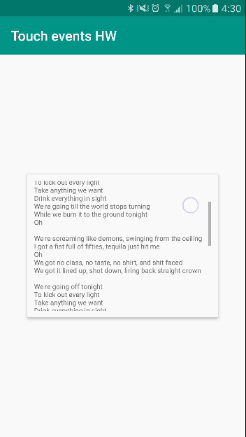

# touch-events

Реализовать увиденное

Элементы интерфейса не обязаны быть функциональными (то есть можно анимировать просто ImageView, лишь бы работала сама анимация)

Опционально: вертикальная прокрутка (подразумевается прокрутка текста)

## Demo

